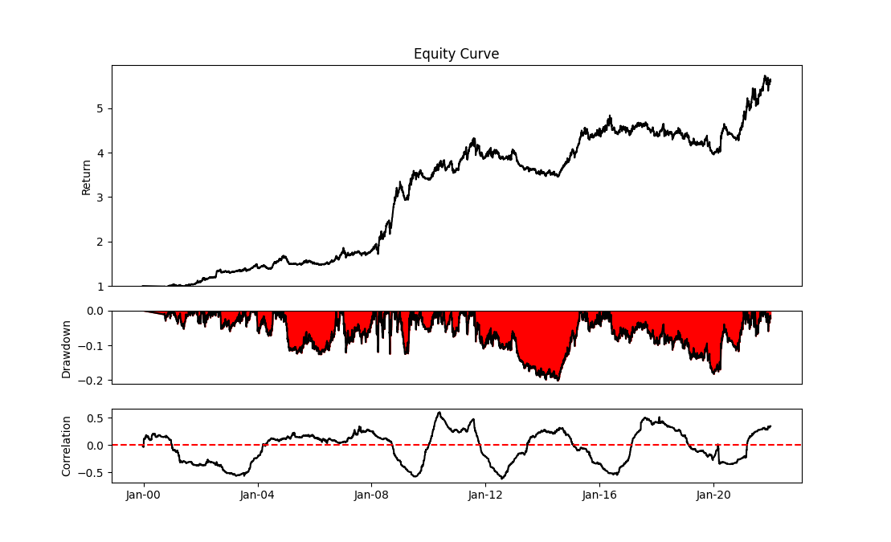

# Backtester (Work in progress)
Rudimentary backtesting framework for futures markets. 

## Results
The CAGR is: 0.0751\
The annual volatility is: 0.0919\
The max drawdown is: -0.2014\
The sharpe ratio is: 0.8340\
The sortino ratio is: 1.2136\
Calmar ratio: 0.3730\
Correlation: -0.0958\
Alpha, Beta: 0.0834 -0.0458

  

